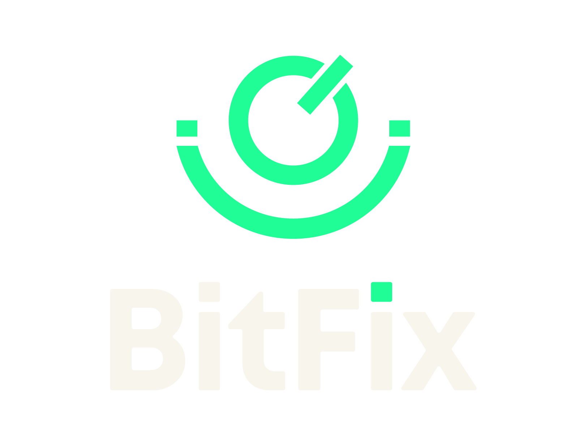

# BitPacs

🏥 BitFix Medical PACS Viewer

Sistema de visualização e gerenciamento de imagens médicas DICOM com interface moderna e intuitiva.

## 📋 Sobre o Projeto

Interface web customizada para visualização de estudos DICOM, desenvolvida com React, TypeScript e Tailwind CSS.

### ✨ Funcionalidades

- 🔍 Busca avançada de pacientes e estudos
- 📊 Visualização de imagens DICOM
- 🎨 Interface moderna e responsiva
- 📱 Compatível com dispositivos móveis
- 🔒 Segurança e conformidade LGPD/HIPAA

## 🛠️ Tecnologias

### Frontend (Proprietário)
- React 18 + TypeScript
- Tailwind CSS
- Axios para requisições HTTP
- Vite para build

- Responsável pelo front-end: Eric Domingues de Souza

### Backend/PACS (Open Source)
- **Orthanc PACS Server** (GPLv3)
  - Repositório: https://github.com/jodogne/orthanc
  - Website: https://www.orthanc-server.com/
  - Licença: GPLv3
  
- **Stone Web Viewer** (Visualizador DICOM)
- **OHIF Viewer** (Visualizador avançado)

- Responsável pela integração do orthanc: Murilo Henrique Reis de Moraes

## 🚀 Instalação

### Pré-requisitos

- Node.js 18+
- Docker & Docker Compose
- Orthanc PACS Server

Configuração

##📝 Configuração do Orthanc
O projeto requer Orthanc PACS Server configurado com:

- CORS habilitado
- Plugins: Stone Web Viewer, OHIF
- DICOMweb habilitado
- Exemplo de configuração: orthanc.json

##📖 Documentação
- Guia de Instalação
- API Reference
- Configuração Avançada

##📄 Licença
Código Proprietário
© 2026 BitFix. Todos os direitos reservados.

O código-fonte deste frontend é proprietário e confidencial.

Componentes Open Source
Este projeto utiliza os seguintes componentes open-source:

- Orthanc PACS Server - GPLv3 License
  - Copyright (C) 2012-2016 Sebastien Jodogne
  - https://www.orthanc-server.com/

##👥 Suporte
- Email: suporte@suaempresa.com
- Documentação: https://docs.suaempresa.com
- Telefone & Whatsapp: (43) 3336-4004

##🏢 Sobre BitFix
[Descrição da sua empresa]

Website: [www.bitfix.com.br](https://www.bitfix.com.br/)
